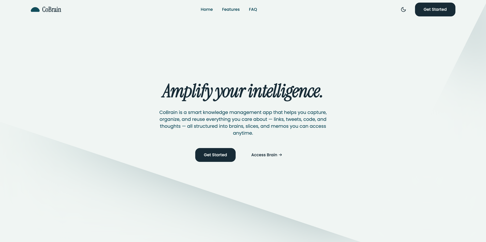

# 🚀 𝗜𝗻𝘁𝗿𝗼𝗱𝘂𝗰𝗶𝗻𝗴 𝘾𝙤𝘽𝙧𝙖�𝗻

```markdown

```


CoBrain is your **𝘀𝗲𝗰𝗼𝗻𝗱 𝗯𝗿𝗮𝗶𝗻** - designed to help you save notes and links, organise it into meaningful slices, and recall information exactly when you need it. It’s simple, flexible, and built to adapt to how _you_ think.

## 🏗 Repository Structure

This is a monorepo managed by [Turborepo](https://turbo.build/repo), containing the following workspaces:

### 📱 Apps

- **`apps/landing`**: Next.js 15 (App Router) frontend with Tailwind CSS and Framer Motion.
- **`apps/server`**: Express.js backend with Bun runtime, Google OAuth, and JWT authentication.

### 📦 Packages

- **`@repo/db`**: PostgreSQL database management with Drizzle ORM.
- **`@repo/ui`**: Shared React component library.
- **`@repo/types`**: Shared TypeScript definitions.
- **`@repo/fonts`**: Shared typography assets.
- **`@repo/eslint-config`**, **`@repo/typescript-config`**, **`@repo/tailwind-config`**: Shared configurations.

## 🛠 Tech Stack

- **Runtime**: [Bun](https://bun.sh/)
- **Frontend**: Next.js 15, React 19, Tailwind CSS, Framer Motion
- **Backend**: Express.js, Passport.js (Google OAuth), Argon2
- **Database**: PostgreSQL, Drizzle ORM
- **Monorepo**: Turborepo

## 🚀 Getting Started

### Prerequisites

- **[Bun](https://bun.sh/)** (v1.1+): This project uses Bun as the package manager and runtime for scripts.
- **Node.js** (v18+): Required for some Turbo/Next.js operations.
- **Docker**: (Optional but recommended) For running the PostgreSQL database locally.

### Installation

1.  **Clone the repository:**

    ```bash
    git clone https://github.com/your-username/cobrain.git
    cd cobrain
    ```

2.  **Install dependencies:**
    ```bash
    bun install
    ```

### Environment Setup

You need to configure environment variables for the apps and database. Check the `README.md` in `apps/landing`, `apps/server`, and `packages/db` for specific details.

Broadly, you will need to set up `.env` files in:

- `apps/landing/.env`
- `apps/server/.env`
- `packages/db/.env`

### Database Setup

1.  **Start PostgreSQL:**
    Navigate to `packages/db` and start the database container:

    ```bash
    cd packages/db
    docker-compose up -d
    ```

2.  **Push Schema:**
    Apply the database schema:
    ```bash
    bun run drizzle:push
    ```

### Running the Project

To start both the frontend and backend in development mode:

```bash
bun run dev
```

This uses Turborepo to run `dev` scripts in all apps simultaneously.

- **Frontend**: http://localhost:3000
- **Backend**: http://localhost:3001 (or configured port)

## 🛠 Commands

Run these commands from the root directory:

| Command | Description |
|Str |---|
| `bun run dev` | Start development server for all apps |
| `bun run build` | Build all apps and packages |
| `bun run lint` | shared linting check |
| `bun run format` | Format code with Prettier |
| `bun run check-types` | Run TypeScript type checking |

## 🤝 Contribution

1.  Fork the repo
2.  Create your feature branch (`git checkout -b feature/amazing-feature`)
3.  Commit your changes (`git commit -m 'Add some amazing feature'`)
4.  Push to the branch (`git push origin feature/amazing-feature`)
5.  Open a Pull Request
